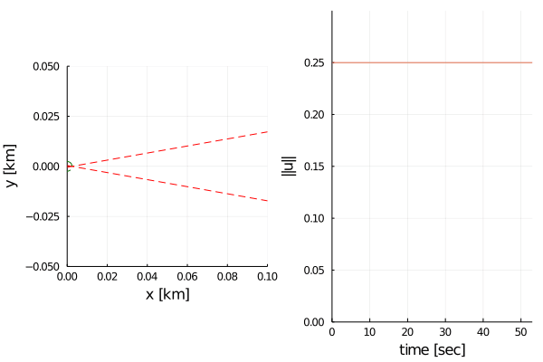

# Input-Constrained-Control-Barrier-Functions

This repo contains supporting files for the submission of the paper

```
Safe Control Synthesis via Input Constrained Control Barrier Functions
```
to CDC 2021, by Devansh Ramgopal Agrawal and Dimitra Panagou. 

The paper is also available here.




